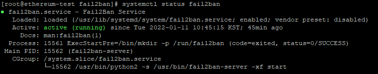
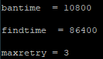

# fail2ban

SSH BruteForce 공격 방어하기

* 본 문서는 Centos7, Python3 기반으로 작성되었습니다.

** 본 문서는 [https://www.lesstif.com/security/fail2ban-ssh-43843899.html](https://www.lesstif.com/security/fail2ban-ssh-43843899.html) 기반으로 작성되었습니다.

# 설치

1. `sudo rpm -Uvh https://dl.fedoraproject.org/pub/epel/epel-release-latest-7.noarch.rpm`
    1. EPEL 설치
2. `sudo yum --enablerepo epel install fail2ban`
    1. fail2ban 설치
3. `sudo systemctl enable fail2ban`
    1. 시스템 시작 시 자동 시작
4. `sudo systemctl restart fail2ban`
    1. fail2ban 시스템 재시작
5. `sudo systemctl status fail2ban`
    - 서비스 작동 상태 확인
    
    
    

# 설정

fail2ban의 기본 설정은 /etc/fail2ban/jail.conf에 있지만, yum 등의 패키지 매니저를 통한 업데이트가 발생한 경우 conf 파일은 교체 되므로 `cp jail.conf jail.local` 로 복사 후 jail.local 파일에 설정 쓰는게 좋음. 또 jail.conf와 jail.local에서 중복 되는 내용은 jail.local의 내용으로 덮어쓰기 됨.

### 주요 설정 항목

1. ignoreip
    1. 여기에 설정된 IP는 로그인에 실패해도 차단하지 않음. Default값은 localhost이며, 콤마 또는 스페이스로 구분하여 여러 IP등록도 가능하다.(subnet mask를 이용한 등록도 가능하다)
        
        ex) `ignoreip = 127.0.0.1/8 123.123.123.123/32 192.168.1.0/24 8.8.8.8/32` 
        
        127.0.0.1/8, 192.168.1.0 대역, 123.123.123.123 그리고  8.8.8.8 IP는 차단하지 않는 설정
        
2. bantime
    1. 인증실패 조건에 성립된 클라이언트 차단 시간 초 단위 설정
    2. 현재 설정은 10800초
3. findtime, maxretry
    1. findtime 이내에 maxretry 횟수만큼 인증 실패 시 차단
    
    
    
    86400초 이내에 3회 인증 실패 시 10800초 차단
    
4. mail 서비스
    1. fail2ban으로 차단한 정보를 메일로 받아 볼 수 있음
    2. destemail에 수신자 메일, sender에는 송신자 정보 설정
    3. mta는 Mail Transfer Agent의 약자로 메일 전송하는데 사용할 에이전트 설정
    4. action항목에는 메일에 포함될 내용 정의
        1. 기본 설정은 action = %(action_)s 로 NOP
        2. action_mw : 메일 전송, ip조회 결과 첨부
        3. action_mwl : 메일 전송, ip조회 결과 및 로그 첨부
        4. 권장 설정은 action = %(action_mwl)s
            1. yum install whois
5. 기타 서비스 추가
    
    [sshd] 처럼 서비스 추가 후 옵션 부여
    
    fail2ban은 기본 서비스가 allow 이므로 enabled = true 옵션이 있어야 차단 활성화
    
    ex) 
    
    [sshd]
    
    enabled = true
    
    port = ssh, 10022
    

### 최종 설정 (jail.local)

[DEFAULT]

ignoreip = 127.0.0.1/8 {AdminIP}/{Subnet}

bantime  = 10800

findtime  = 60

maxretry = 3

destemail = {Admin Email}

sender = [fail2ban@](mailto:fail2ban@my-server.com){Domain}}.com

mta = sendmail

action = %(action_mwl)s

[sshd]
enabled = true
port     = ssh

$ `sudo systemctl restart fail2ban`

변경 사항 반영 위해 서비스 재시작

$ `sudo fail2ban-client status sshd`

차단 현황 확인

$`sudo fail2ban-client set sshd unbanip 000.000.000.000`

차단 해제

### Ref

1. [https://www.fail2ban.org/wiki/index.php/Main_Page](https://www.fail2ban.org/wiki/index.php/Main_Page)
2. [Ubuntu 에 fail2ban 을 설치하여 보안을 강화하기.](https://blog.lael.be/post/1209)
3. [https://blog.asamaru.net/2016/04/07/how-to-protect-ssh-with-fail2ban-on-centos-6-7/](https://blog.asamaru.net/2016/04/07/how-to-protect-ssh-with-fail2ban-on-centos-6-7/)
4. [How To Protect SSH with Fail2Ban on Ubuntu 14.04](https://www.digitalocean.com/community/tutorials/how-to-protect-ssh-with-fail2ban-on-ubuntu-14-04)
5. [https://www.lesstif.com/security/fail2ban-ssh-43843899.html](https://www.lesstif.com/security/fail2ban-ssh-43843899.html)